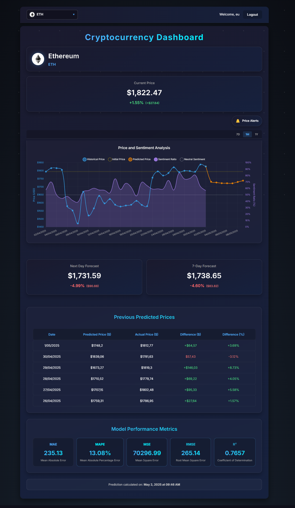
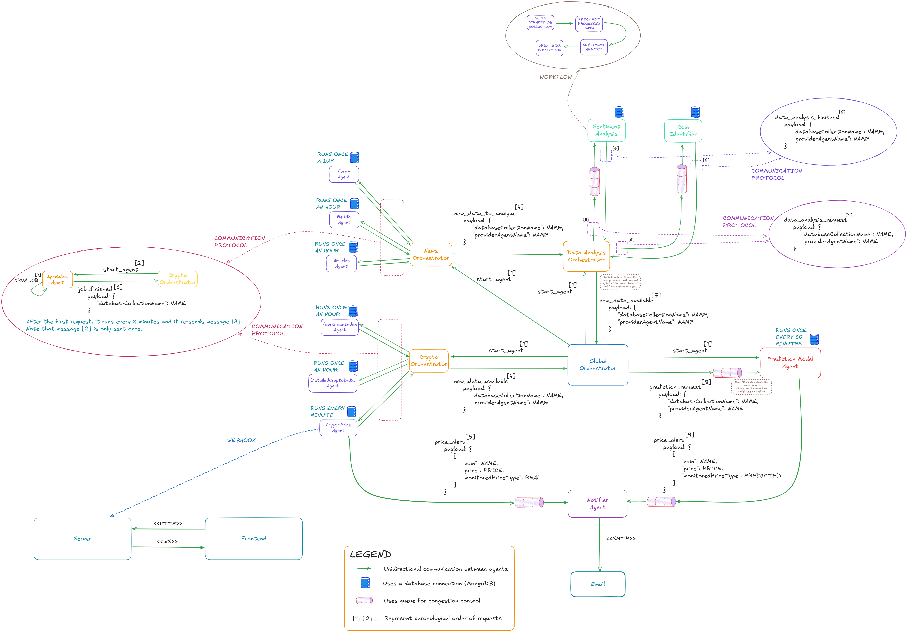

# Multi-Agent System Project

This repository contains the project for the Multi-Agent Systems course. The project implements a multi-agent system for cryptocurrency market analysis. It uses a Python backend to manage a society of agents that collect, analyze, and report on cryptocurrency data. A web-based frontend, built with Node.js, provides a user interface to visualize the market analysis, agent activities, and system state. The backend communicates with a MongoDB database to persist data.

## Project Overview

The core of this project is a multi-agent system designed to perform real-time analysis of the cryptocurrency market. Different agents are assigned specialized tasks:

-   **Data Collection Agents**: These agents are responsible for gathering real-time and historical data from various sources, such as cryptocurrency exchanges and financial news APIs.
-   **Analysis Agents**: These agents process the collected data. They perform technical analysis (e.g., calculating indicators like RSI, MACD) and sentiment analysis on news articles to gauge market mood.
-   **Decision Agents**: Based on the analyses, these agents formulate insights or potential trading signals.
-   **User Interface Agent**: This agent acts as a bridge between the user and the system, managing user preferences and displaying tailored information on the frontend.

The frontend provides a dashboard to visualize the outputs of the analysis agents, including price charts, technical indicators, and market sentiment trends.



## Architecture

The project is composed of two main components:

-   **Backend**: A Python application responsible for running the multi-agent system. It uses a MongoDB database for data persistence and exposes a REST API for the frontend.
-   **Frontend**: A web application built with Node.js that serves as the user interface for monitoring and interacting with the agents in the system.

The following diagram illustrates the system's architecture and the interactions between the different agents:



## Installation and Setup

Follow these steps to get the project running on your local machine.

### 1. Clone the repository

```bash
git clone https://github.com/tomas-oliveira03/ASM.git
cd ASM
```

### 2. Backend Setup

The backend is a Python application that requires a MongoDB instance.

1.  Navigate to the backend directory:
    ```bash
    cd Backend
    ```
2.  Install required Python packages.
3.  Copy `.env.example` to `.env` and fill in your API keys and credentials.
4.  Start a MongoDB server.
5.  Run the system agents setup file:
    ```bash
    python main.py
    ```
6.  Run the backend server:
    ```bash
    python Server/app.py
    ```
    The backend API will be running on `http://localhost:3001`.

### 3. Frontend Setup

The frontend is a web application built with Node.js.

1.  Navigate to the frontend directory from the project root:
    ```bash
    cd Frontend
    ```
2.  Install dependencies:
    ```bash
    npm install
    ```
3.  Ensure the backend API is running.
4.  Start the development server:
    ```bash
    npm run dev
    ```
5. Open your browser and navigate to `http://localhost:5173/`
